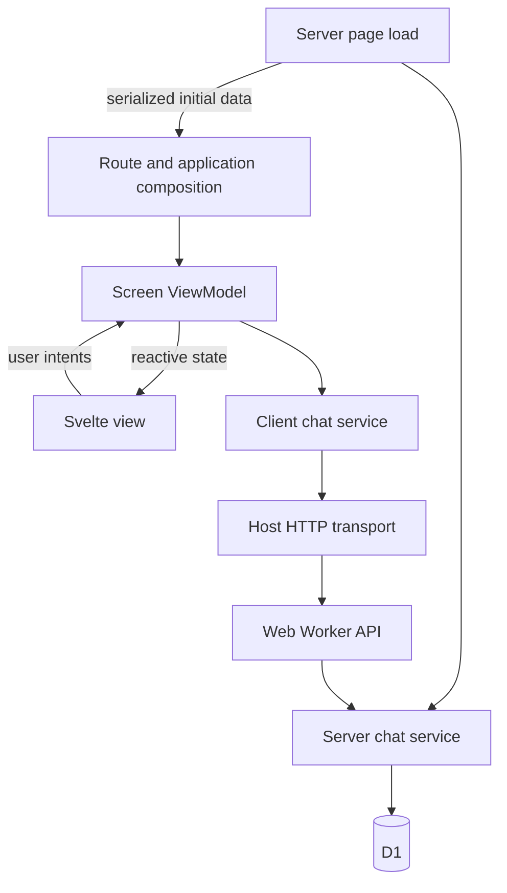

# Frontend architecture review

Reviewed 2026-10-07. Scope: Starter's chat, notes, platform transport, screen lifecycle and composition; Aikami's link view, composition, base view model, base frontend class and service exports. This is a source review, not a whole-repository audit or performance benchmark. Existing tests were read, not executed. Findings described as risks need runtime reproduction; code-visible contract violations are identified separately.

## Recommendation

Keep the View → ViewModel → feature service structure, organize it by feature, and keep application composition separate. Add a small Svelte-aware runtime for asynchronous screen work, strengthen the HTTP contract to support streaming, and define ownership and reconciliation rules explicitly.

The current architecture is a good starting point, but its correctness guarantees are overstated in several places. The main problems are incomplete boundaries and repeated asynchronous bookkeeping. Moving files into a central services folder or restoring the full inheritance chain would not resolve them.

There is no architecture that guarantees zero bugs or maximizes every goal simultaneously. For this repository, the useful target is: a developer or agent can understand one feature locally; host differences have one owner; asynchronous work cannot silently overwrite newer state; failure states are visible; browser behavior is verified at the browser boundary.

## What the current layers actually do



The four files you named are four distinct responsibilities:

| File | Responsibility | Assessment |
|---|---|---|
| `routes/chat/+page.svelte` | Bridge SvelteKit data and navigation into the feature | Appropriate; explicit snapshot reconciliation needs improvement |
| `chat_list_view.svelte` | Markup, accessibility, rendering state and raising intents | Appropriate; navigation should generally use links |
| `chat_list_view_model.svelte.ts` | Draft, list state, load/create orchestration and navigation intent | Appropriate; creation now enforces single-flight and distinguishes navigation failure |
| `chat_service.ts` | API paths, response validation and chat stream protocol | Appropriate responsibility; streaming now uses the transport’s `openStream` capability |

The client and server chat services are different adapters. One speaks HTTP and stream frames; the other executes authorized application operations against storage. Sharing DTO schemas is useful. Trying to merge those services across the runtime boundary would be harmful.

## Starter versus Aikami

Aikami's link feature already has an important good property: `link_composition.ts` injects a narrow `AuthCapabilities` contract. Its view model does not resolve the auth singleton itself. That is substantially the same dependency direction Starter should preserve.

However, the link view model imports `$app/state` and reads `sessionStorage` directly. It is tied to the web host despite receiving auth through an interface. Starter's portable features go further: the host supplies navigation and transport. A reusable link feature would also receive the handoff code, persistence and time capabilities where needed.

The two repositories organize code along different axes:

| Approach | Advantages | Costs |
|---|---|---|
| Central `services/` plus separate `views/` | Familiar map of service types; convenient for broadly shared application systems | One feature change spans distant directories; broad barrels can encourage hidden dependencies and eager initialization |
| Feature folders containing views, view models and services | Related code stays together; easier deletion, review and agent context selection | Needs rules for feature-to-feature dependencies and genuinely shared services |
| Separate package for every feature and layer | Strong package-level boundaries and independent ownership | More manifests, exports, configuration and coordinated edits |

I recommend the middle approach here. The web and native applications already share frontend features, so a reusable package is justified. Keep one features package initially; split a feature into its own package when separate ownership, reuse, dependency weight or release requirements justify it.

Centralize genuinely shared capabilities such as session, authenticated transport, persistence and telemetry by their ownership. Keep a chat API client with chat. Having two consumers does not automatically make a service generic infrastructure.

Aikami's service barrel exposes many domains. That is a scaling pressure, not proof that all of those services are wrongly placed or that the bundle necessarily includes everything. Production bundle behavior must be measured; module side effects and singleton initialization matter more than the directory label.

## Why Starter has no BaseViewModel

[`screen.ts`](../packages/frontend/ui/src/screen.ts) records that Starter previously had a three-level chain: `BaseFrontendClass → BaseViewModel → BaseFormViewModel`. The surviving approach composes `StaleGuard`, `MutationGuard` and `disposeScreen`, and implements a structural `ScreenOwner` interface. This is an intentional simplification. The historical audit described in that comment was not independently reproduced in this review.

Aikami's `BaseViewModel` provides useful things: reactive loading/error fields, lifecycle conventions and cleanup for manually owned effect roots. Those are legitimate reusable responsibilities. Its inherited `BaseFrontendClass` also grants access to a global dialog registry, loading UI, notification handling and command helpers. That enlarges every subclass's implicit dependency surface.

My preference is a composed `ScreenScope` and reactive `AsyncOperation`, rather than restoring the complete chain. A thin `BaseViewModel` is also reasonable if your team finds it clearer, provided it delegates to the same tested primitives and owns only lifecycle. Avoid inherited navigation, HTTP, session lookup, generic forms and global dialogs.

Composition is not automatically superior: Starter currently repeats counters, guards, cancellation checks and `finally` blocks. This repetition is already producing inconsistent behavior. Extract shared policy, not merely shared spelling.

The choice should be between two small ways to reuse lifecycle behavior. It should not dictate the screen's domain state. Loading a transcript, creating a conversation and retrying an unsent message are distinct operations and need distinct state.

Svelte explicitly supports reactive class fields. Classes are a suitable view model representation. Framework documentation also makes manually created effect roots the caller's cleanup responsibility. [Svelte `$state`](https://svelte.dev/docs/svelte/$state), [Svelte `$effect`](https://svelte.dev/docs/svelte/$effect).

## Findings to address before reorganizing

### 1. Chat streaming violated the transport boundary — pre-change finding, resolved

Before the runtime changes, [`ChatService.streamTurn`](../packages/frontend/features/src/chat/chat_service.ts) called a separate fetch with a relative URL and cookie credentials, and tried to obtain authorization from an undeclared public transport property. That bypassed the configured origin and native bearer policy.

**Resolution:** `streamTurn` now calls the injected transport's `openStream` capability. `HttpTransport` opens the response through its shared URL, credentials, error and cancellation policies; the native bearer decorator also implements `openStream`. The chat service parses frames without inspecting credentials or issuing a separate fetch. This resolves the source-visible boundary defect; it does not establish that native chat has been composed or exercised end to end.

### 2. Notes mutation state is not reactive — high priority

[`NotesViewModel.isMutating`](../packages/frontend/features/src/notes/notes_view_model.svelte.ts) reads `MutationGuard.busy`, whose counter is a plain private field in an ordinary TypeScript class. [`note_form.svelte`](../packages/frontend/features/src/notes/note_form.svelte) uses that getter for disabling submit and showing “Saving…”. Changing the counter creates no Svelte reactive dependency.

Direct unit assertions can correctly observe the getter changing while DOM bindings receive no notification. This is a source-visible reactivity gap; the exact browser symptoms were not reproduced here. Chat's separate `$state` counter avoids this particular problem but duplicates bookkeeping.

**Recommendation:** keep the framework-free cancellation primitive, and add a Svelte-aware operation object with a reactive pending count and error/result state. Use that object consistently. Verify the rendered disabled state during a deferred request, not only a getter after calling a method.

### 3. Unmount delayed cancellation until initialization settled — pre-change finding, resolved

Before the runtime changes, [`ScreenContainer`](../packages/frontend/ui/src/screen_container.svelte) waited for `initialize()` to settle before disposing, so a hanging initialization could delay cancellation indefinitely.

**Resolution:** the effect cleanup now calls `disposeOnce()` immediately, clears `mounted`, and invokes `dispose()` without waiting for initialization. The screen owner remains responsible for cancelling work and handling resources acquired after closure. The component's introductory comment still describes the old delayed behavior and should be aligned with the implementation; it is not evidence of the current lifecycle.

### 4. Conversation creation lacked an internal concurrency rule — pre-change finding, resolved

Before the runtime changes, [`ChatListViewModel.create`](../packages/frontend/features/src/chat/chat_list_view_model.svelte.ts) allowed overlapping creates and returned a boolean that conflated a failed write with failed navigation after a successful write.

**Resolution:** `create()` now checks `isCreating` and runs creation with `{ singleFlight: true }`. Its tagged results distinguish `created`, `created-navigation-failed`, `rejected` and `unknown-outcome`. The created conversation is retained in the list before navigation, and navigation failure supplies an explicit message to open it from the list. Safe retry after a lost creation response still requires a server-backed idempotency policy; the distinct unknown-outcome result does not itself provide one.

### 5. New server snapshots do not supersede pending list reads

`ChatListViewModel.seed()` replaces the conversations but does not invalidate a pending `load()`. A previous read can later pass its current-token check and overwrite the newer snapshot. `seed()` and `load()` therefore do not participate in the same ordering policy.

The route's effect also copies server data into mutable screen state. That can be a necessary adapter, but it needs a documented policy for pending creates and locally added rows.

**Recommendation:** every authoritative snapshot should advance the read generation. Define reconciliation for local writes rather than treating array identity as freshness. Reuse this rule across notes, chat and jobs where applicable.

### 6. Native transport guarantees have holes

In [`bearer_transport.ts`](../apps/frontend/native/src/lib/platform/bearer_transport.ts), caller options are spread after `credentials: 'omit'`, allowing a caller to replace it. When the token reader returns null, a caller-supplied authorization header is retained. Header object merging also does not consistently account for case-insensitive HTTP names.

These are code-visible deviations from the decorator's stated policy; they do not establish a server authorization bypass.

**Recommendation:** build headers with `Headers`, delete caller authorization before applying the current session token, and apply enforced credential policy after caller options. Test null-token and header-case boundaries for every supported response mode.

### 7. HTTP error classification differs between response modes

[`HttpTransport.request`](../packages/frontend/platform/src/api_transport.ts) parses JSON before checking HTTP status. An HTML 401 or 429 becomes a generic server/non-JSON error. Failures while consuming the body are outside its fetch error normalization. Binary requests and chat streaming have different parsing and classification paths.

**Recommendation:** preserve HTTP status classification independently of whether an error body is valid JSON. Validate the error envelope, normalize body-read failures and cancellation, and keep raw proxy HTML out of user-facing messages.

### 8. Feedback remains a hidden dependency and can be invisible to users

Notes calls `reportError()`, which resolves the global dialog capability. The web layout's snackbar implementation writes to the console. A failed save can leave the ordinary user without a visible explanation.

**Recommendation:** represent actionable operation errors in screen state and render them next to the operation. Inject optional toast/telemetry capabilities for supplementary feedback. Scope application capabilities through the layout/context where appropriate rather than relying on a mutable global registry.

The current session singleton is seeded in a browser-only effect; this review found no demonstrated SSR identity leak in that path. Still, layout-scoped state makes lifetime and isolation more explicit and reduces the chance of a future SSR consumer using the singleton incorrectly. SvelteKit warns against server-shared user state and documents context as an isolation mechanism. [SvelteKit state management](https://svelte.dev/docs/kit/state-management).

### 9. Streaming retains and repeatedly processes more data than necessary

The service retains every update, accumulated text and the terminal message, while the view model also stores transcript content. Every delta maps over the whole transcript and concatenates the streaming reply.

This is a scaling concern, not measured evidence of current slowness. Long transcripts and many small chunks increase allocation and repeated work. The parser also has no frame-buffer ceiling and only recognizes LF blank-line delimiters; that is adequate for the current encoder but is not a general SSE implementation.

**Recommendation:** use a discriminated event union, keep only the terminal summary unless event history is requested, update the identified reply directly, and consider batching publication to animation frames when measurements justify it. Bound frame buffers and define the supported protocol. Add pagination before assuming indefinitely long transcripts fit in one response.

### 10. Same-conversation refresh deliberately ignores new server data

The keyed chat route correctly replaces the screen when conversation ID changes. Its `chat_screen.svelte` seeds only at mount to preserve drafts, queue and active replies. This is a reasonable ownership choice, but it also means later server history for the same conversation is ignored.

**Recommendation:** separate one-time construction from `reconcileServerSnapshot`. Preserve drafts and unsent queue entries while merging acknowledged server messages by stable identity. Define when refresh is allowed during streaming and how multiple tabs reconcile.

### 11. Navigation and failure handling can be clearer

Conversation items use buttons whose handlers discard the promise from `open()`. A rejected navigation can escape without feedback. Buttons also lose native link affordances such as opening in another tab.

**Recommendation:** use real links for ordinary destination navigation, with the host supplying hrefs if route paths differ. Keep injected navigation for post-mutation transitions and other imperative actions, and handle its failure explicitly.

### 12. Documentation and names sometimes describe stronger guarantees than exist

Examples: comments claim ordinary Svelte `{#if}` chains are exhaustively checked; claim notes drafts are in the view model although the form holds them locally; claim mutation IDs are monotonic although the ID comes from an in-flight counter; and describe shared infrastructure as unreachable from outside when it is exported.

`NotesService` and `ChatService` have `.svelte.ts` suffixes despite containing no runes. That obscures which modules require the Svelte compiler. Starter also still has a substantial `BaseClass`; `HttpTransport` extends it and is constructed with `new`, so the documented canonical `.create()` tracing path is not used there.

**Recommendation:** shorten comments to current invariants and their reasons, put history in review documents, use `.ts` for nonreactive clients, and choose explicit logging conventions. If exhaustive state handling is required, implement an actual checked mapping or exhaustive switch. A comment cannot enforce it.

## Proposed structure

```text
packages/frontend/features/src/
  chat/
    index.ts
    chat_contracts.ts                 # narrow screen dependency and event types
    chat_service.ts                   # endpoint calls and DTO validation
    chat_stream.ts                    # incremental protocol parsing
    chat_list_view_model.svelte.ts
    chat_list_view.svelte
    chat_view_model.svelte.ts
    chat_view.svelte
    chat_composer.svelte
    ...colocated tests
  notes/
  auth/
  jobs/

packages/frontend/platform/src/
  api_transport.ts                    # JSON transport contract
  streaming_transport.ts              # streamed response contract
  http_transport.ts                   # shared URL/auth/error request pipeline
  capabilities.ts                     # navigation and other host contracts

packages/frontend/ui/src/
  screen_scope.svelte.ts               # lifetime and reactive operation ownership
  async_operation.svelte.ts            # pending/error/result state
  screen_container.svelte
  ...UI components

apps/frontend/client/src/lib/
  composition/                        # construct application dependencies
  server/                             # server composition and domain adapters
  runtime/                            # validated host configuration

apps/frontend/native/src/lib/
  composition/
  platform/                           # bearer policy, Tauri and persistence
```

This is a direction, not a mandate to create every file immediately. Keep small cohesive modules together; split the HTTP implementation and stream parser when the boundaries make the code easier to understand. A dedicated frontend runtime package can replace placement in `ui` if it develops meaningful independent consumers. Do not add that workspace just to rename a folder.

The dependency rule should be:

```text
route → application composition → feature ViewModel
view → screen state and intents
ViewModel → narrow feature service contract + explicit host capabilities
feature service → transport capability + shared DTO schemas
transport → host request policy and fetch
```

Use a small `Pick<ChatService, ...>` or named interface at view model boundaries. The current concrete class types contain private fields, which makes structurally typed fixtures harder to inject. Do not create parallel interfaces for every class automatically; expose contracts at actual substitution boundaries.

Continue importing `@starter/features/chat` rather than the whole features barrel. If import analysis or bundle measurements show unwanted coupling within that subpath, add selective exports. Keep feature-to-feature dependencies explicit; avoid circular service graphs and a catch-all service locator.

## Runtime rules worth standardizing

1. A screen instance has one owner and a stated lifetime. Fresh instances are the default after disposal.
2. Unmount synchronously closes the scope and aborts work; late completions cannot publish state.
3. Reads have a generation per independent resource. Search and pagination should not accidentally cancel unrelated operations.
4. Writes choose their policy explicitly: single-flight, concurrent by entity, or sequential queue. A shared counter does not choose that policy.
5. UI-observed pending and error fields are reactive. Infrastructure counters alone are insufficient.
6. New authoritative snapshots supersede earlier reads. Local drafts and pending writes have explicit reconciliation rules.
7. Cancellation means the client stopped waiting. It does not prove that a server mutation never committed.
8. API clients return validated domain data or throw classified errors. View models decide recovery and presentation.
9. Mutation commit and subsequent navigation are different outcomes. Avoid boolean results that conceal that distinction.
10. Effect roots, subscriptions, object URLs and readers register cleanup with the owner that created them.

These policies reduce bugs more effectively than forcing every view model to inherit identical loading and error fields.

## Performance and scalability

Retain server rendering and initial-data seeding. Constructors should prepare state without initiating network requests or browser side effects. Effects do not run during SSR, so moving initial seeding entirely into an effect would lose the populated server render. [Svelte `$effect`](https://svelte.dev/docs/svelte/$effect).

During refresh, consider retaining visible data and indicating `refreshing` rather than replacing an established screen with a spinner. This is a UX/state decision, not a reason to reintroduce unrelated booleans everywhere.

Add a shared server-state cache only when multiple mounted screens genuinely need synchronization, deduplication or freshness policies. If introduced, one cache owns server entities and view models own local drafts and operation intent. Avoid independently authoritative copies in the cache, service singleton and every screen.

Measure production route bundles, network waterfalls, transcript update cost, retained event history and hydration behavior before claiming performance gains. Directory movement and inheritance removal do not by themselves make the product faster.

## Developer and agent experience

The architecture should let someone open `chat/` and find its behavior, API contract, views and tests without traversing a registry or inheritance hierarchy. Familiar view model naming is useful; preserve it.

Use one short architecture guide with placement rules and links to a few canonical examples. Turn the async policies above into a checklist and focused executable fixtures. Avoid copying long historical explanations into every feature file: those comments consume context and can mislead both humans and agents when behavior changes.

Provide a small feature scaffold or template only after chat and notes share the corrected runtime conventions. A generator should create real wiring and meaningful fixture examples; duplicating today's lifecycle bugs faster would worsen the system.

Enforce runtime boundaries, prohibited global fetches in feature clients, host imports and explicit feature dependencies with existing guard infrastructure. Changing names or adding capability files must be reflected in role classification and import rules; do not weaken the guards to accommodate a reorganization.

“LLM optimized” should mean locally understandable and mechanically constrained. There is no measured agent-performance result in this review. The expected benefits are fewer files needed to understand a feature, fewer hidden dependencies, clear result types and failures that tests can reach.

## Suggested order of work

| Phase | Work | Evidence to require |
|---|---|---|
| 1: correctness | Streaming transport, native policy holes, reactive mutation state, create result/concurrency, immediate cancellation | Captured wire requests for JSON/bytes/streams; real Svelte pending-state checks; deferred initialization/unmount and late-completion cases |
| 2: consistency | Small screen runtime, snapshot reconciliation, visible operation errors, narrow service contracts | Refresh racing reads/writes; navigation failure after commit; queue preservation; overlapping operation cases |
| 3: clarity | Nonreactive `.ts` names, concise comments, placement guide and selective public API | Guard classification remains enforced; imports and examples match actual behavior |
| 4: growth | Pagination, measured stream updates, cache only where required, selective package extraction | Browser profiles, route bundles, freshness/deduplication behavior and multi-consumer requirements |

For an implementation, validate at the appropriate boundaries: unit fixtures for ordering and protocol cases, real Svelte browser checks for reactivity and lifecycle, built Worker checks for endpoint/auth/idempotency semantics, and E2E for create → navigate → stream. Keep these credential-free where possible and identify live prerequisites explicitly.

No tests, build, lint, typecheck or runtime probes were run for this report. It proposes verification cases; it does not claim those cases pass.

## Decision

Keep feature-local services and view model classes. Preserve application composition and the browser/server/native boundaries. Make the transport cover every network mode. Reuse lifecycle and operation policy through a small reactive runtime, with an optional thin base view model if that improves team consistency. Fix the code-visible correctness gaps before changing the folder map.
