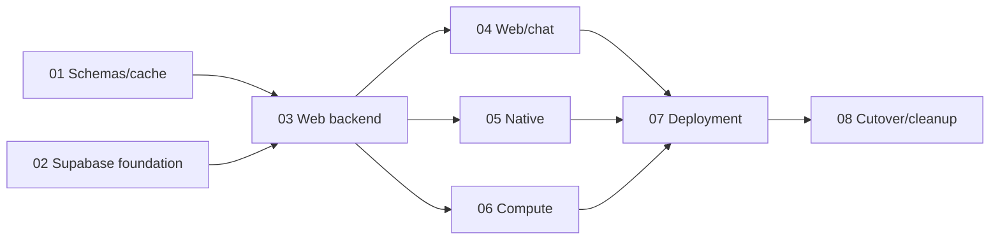

# Supabase and Cloudflare implementation plan

> **For agentic workers:** Use `superpowers:executing-plans` to implement the selected prompt task by task. Each prompt runs in a separate Herdr worktree and produces one PR. The user selected independent prompt/worktree/PR execution; do not turn this into one giant branch. Parallel execution means separately assigned sessions, not permission for a session to recursively delegate.

**Goal:** Replace D1/Better Auth with Supabase, adopt Valibot and web remote functions, harden chat, move optional processing to Cloud Run, and finish with a reproducible cross-platform starter.

**Architecture:** Supabase owns identity and relational data; the SvelteKit Worker owns application operations and HTTP/remote adapters; R2 owns objects. Cloudflare Workflows retains durable orchestration while Cloud Run Jobs executes the processor. Experimental transports stay out of portable features.

**Tech stack:** Existing pinned SvelteKit 3/Svelte 5/Bun/Cloudflare/Tauri/Rust, Valibot, Supabase JS/SSR/CLI, Resend SMTP/API, Google Cloud Run Jobs. Resolve and pin exact compatible provider library versions when adding them; do not copy unverifiable future versions.

**Spec:** [Execution design](../specs/2026-10-07-supabase-cloudflare-design.md). [Schema recommendation and measured limits](../../reviews/2026-10-07-schema-selection.md).

**Cloud Run references:** PRs 06 and 07 use [the reviewed Nordclaw Rust/deployment/setup references](../../reviews/2026-10-07-nordclaw-cloud-run-reference.md). These are optional source examples with explicit adaptations, not dependencies on the sibling repository. Starter's media build/runtime controls remain authoritative.

## Global constraints

- Eight planned PRs; hard limit 99 changed paths per PR, soft target 85 or fewer. File estimates below are allowances, not measured final diffs.
- Every PR has its own Herdr checkout, branch, dependency installation, Supabase project/ports, runtime state, and verification evidence.
- Current inspected base is `71c2d9c` on `feat/e2e-visual-quality`, not an assertion that those changes are on `origin/main`. Integrate that prerequisite through its existing review before starting the train, or explicitly use an approved stacked base. Do not silently lose the E2E work by branching an older main.
- Preserve untracked `docs/plans/` and other user work. No stash/reset/cleanup of unrelated paths; no remote deletion, provisioning, deployment, or migration as part of these implementation prompts.
- Default runtime stays complete during additive PRs. The explicit temporary Supabase preview profile has mandatory checks and no fallback. PR 08 removes the temporary profile and legacy implementations together.
- Valibot application contracts preserve public exports and strict validation. TypeBox stays only at host-required Pi registration boundaries.
- SQL migrations own database structure; generated database types are committed derived artifacts; DTOs remain application contracts.
- Identity and Supabase user clients are request-local. Privileged clients, Google dispatcher credentials, refresh tokens, and signed object grants never reach browser bundles, logs, argv, or verification artifacts.
- User ids become Supabase UUIDs in the Supabase profile. Other resource ids preserve their established domain prefixes unless a migration specifically changes them.
- No blank test passes, blanket skips, weakened ownership assertions, live checks replaced by mocks, or unpinned `bunx` tools.
- App roots remain in place for this train. Profiles/catalog expansion, billing, multi-tenancy, broad agent setup redesign, and a wholesale folder rename are separate future work.

## Execution order

| Prompt | Deliverable | Depends on merged | Target changed paths |
|---|---|---|---:|
| 01 | Valibot contracts, complete cache inputs, PR budget guard | baseline | 55–80 |
| 02 | Local Supabase, SQL/RLS/RPCs, generated types and repositories | baseline | 40–70 |
| 03 | Supabase web identity and application-services preview | 01, 02 | 65–90 |
| 04 | Web remote functions, bounded chat generation and pagination | 03 | 35–65 |
| 05 | Native Supabase PKCE, refresh and vault credentials | 03 | 30–55 |
| 06 | Postgres workflows, Cloud Run runner, R2 grants and maintenance | 03 | 45–75 |
| 07 | One cross-provider deployment plan/preflight/apply boundary | 04, 05, 06 | 45–80 |
| 08 | Sole Supabase default, legacy removal, evidence and smoke | 07 | 60–90 |

**Wave 1:** 01 and 02 can implement concurrently. Their main code roots differ; manifest/lock/Moon/shared-path edits are coordination points. Merge 01 first, rebase 02, regenerate its lock with pinned tools, and rerun its checks. Do not merge two independently edited lockfiles by text union.

**Wave 2:** 03 alone. It freezes the session facade, services, Supabase preview wiring, and job repository interfaces.

**Wave 3:** 04, 05, and 06 can implement concurrently in three checkouts. 04 owns web notes/chat composition and feature chat/notes modules; 05 owns native and shared auth/session-store changes; 06 owns jobs/media and backend job wiring. Root manifests/lock/CLI/workflows merge sequentially. Do not have 04 redesign auth facades that 05 consumes, or 06 alter the frozen job interface without coordinating.

**Wave 4:** 07 alone against all three merged consumers. **Wave 5:** 08 alone after every predecessor is integrated. Final verification consumes one actual combined tree.

Eight is the smallest reasonable train I recommend here: schema migration, SQL authorization, identity, web/generation semantics, native lifecycle, cross-cloud compute, deployment authority, and final removal each deserve independent review. If a prompt exceeds 99 paths after its scope inventory, split that cohesive task before publishing; never hide files from review just to preserve the eight-prompt count.

## Common execution contract — applies to every prompt

1. Read root `AGENTS.md`, the spec, this plan, the selected prompt, and applicable subtree instructions. Refresh source inventory and record starting SHA. Inspect existing branch/worktree ownership. No changes in the original working checkout.
2. Inspect Herdr availability and current `herdr worktree create --help`. From a managed session, create the prompt's worktree with the repository's actual `--cwd`, actual merged base, declared branch/label, and `--no-focus`. Record returned checkout/workspace identifiers. Never infer or control an existing focused pane. If Herdr cannot create a managed workspace, report its actual prerequisite; do not claim one was created.
3. Enter the returned checkout and run `bun install --frozen-lockfile`. Deliberate dependency changes then update the lock through the package that owns the tool. Pin the new dependencies. Never copy another worktree's `node_modules` or runtime secrets.
4. Inventory affected paths, including fixtures, generated types, deleted files, and expected review fixes. Reserve at least 9 paths below the hard cap. Work from the latest merged dependency commit; unrelated historical/unmerged work is not part of this PR.
5. Use checkout-owned ports/state. Read current `dev_ports.ts`, `run_scope.ts`, E2E runtime, and Supabase isolation helper rather than stale API-port examples. After 02, require unique local Supabase project id, API/Postgres/Studio/mail ports, and owner token. Never stop/reset another checkout's stack.
6. Write meaningful failure fixtures before implementation, observe failure, implement, observe success. Use unit tests for deterministic policy, real local Supabase for transactions/RLS, browser tests for UI/reactivity, built workerd for Worker/remote behavior, and Docker/Rust for processor behavior.
7. Execute required checks for the change. Missing prerequisites are NOT RUN with cause and exact command; a required lane remains unresolved and must not be called complete. A fixture verification does not certify a deployed provider or a physical device.
8. Count the actual PR-base diff with renames treated conservatively as delete+add, including generated/deleted paths. PR 01 adds `bun run pr:budget -- --base origin/main --max-files 99`; other sessions must use it after rebasing to the applicable base. Before it exists, combine unique paths from committed base diff, working diff against HEAD, and untracked source owned by this PR. Hard cap 99; no path exclusions.
9. Commit only this prompt's files, push its branch, and create one PR to the actual base using the repository PR template. Creating a PR is the execution prompt's deliverable; merging is coordinated outside the prompt. Do not provision/deploy to make a fixture-tested integration appear live-verified.
10. Report PR URL, base/head SHA, changed-path count, validation evidence, NOT RUN checks, and exact interface changes. Process CodeRabbit findings against the latest head; read all pages/threads and distinguish stale findings. Relevant review fixes remain in this same PR and must remain under the cap. Do not automatically comment or alter unrelated PRs.

## Review focus

1. Unknown ownership fields, invalid optional/null values, and unexpected SDK responses must remain refusals after schema migration — owned by 01/03.
2. Direct Data API callers, revoked users, and concurrent admissions must not bypass RLS, quotas, or idempotency — owned by 02/03/04/06.
3. Logout while native refresh completes, reused PKCE callbacks, and cross-environment credentials must not restore or leak sessions — owned by 05.
4. A cloud dispatch succeeding before its recording fails, stale runner completion, or an expired object grant must not double-commit or accept foreign output — owned by 06.
5. Local and CI commands targeting different Supabase/Google/Cloudflare environments must fail during planning/preflight rather than mutate the wrong resource — owned by 07/08.

## Ready-to-paste prompts

Each linked file is one execution prompt. Read its common contract above; it is part of the prompt. Execute just the selected file in its own session.

- [01 — Valibot, cache correctness and PR budget](supabase-cloudflare-prompts/01-valibot-cache-budget.md)
- [02 — Supabase database and local isolation](supabase-cloudflare-prompts/02-supabase-foundation.md)
- [03 — Supabase web identity and services](supabase-cloudflare-prompts/03-web-backend.md)
- [04 — Remote functions and chat correctness](supabase-cloudflare-prompts/04-web-remote-chat.md)
- [05 — Native Supabase authentication](supabase-cloudflare-prompts/05-native-auth.md)
- [06 — Cloud Run compute and maintenance](supabase-cloudflare-prompts/06-cloud-run-compute.md)
- [07 — Cross-provider deployment authority](supabase-cloudflare-prompts/07-deployment.md)
- [08 — Cutover, legacy removal and evidence](supabase-cloudflare-prompts/08-cutover-evidence.md)

## Completion evidence

- Fresh `bun run typecheck`, `bun run lint`, `bun run format`, `bun run guard:whole-repo`, `bun run workflows`, and `bun run evidence` on the final head.
- Fresh unit/browser/Worker/E2E lanes on Supabase with nonzero discovered test counts; integration checks verify two synthetic users and the Data API directly.
- Real local Supabase reset/migrate/type generation; generated output matches migrations; account/mail flows use local capture.
- Real Rust/container processing and runner/Workflow/R2/Postgres interaction, with finite failure/retry/cancellation budgets.
- Native platform-independent auth/vault tests, static artifact checks, and existing native build CI. Simulator/browser fixtures are not physical-device results.
- Fresh template smoke including a web-only copy with native/compute removed. Optional-disabled commands refuse explicitly and remaining tests still exercise real behavior.
- No application D1/Better Auth/Cloudflare Container runtime edges; no temporary backend selector; no credential-bearing browser artifact.
- Cloud Run deployment/execution, Supabase hosted operation, delivered Resend SMTP, and physical-device flows are live gates owned by the operator. Record them as NOT RUN unless actually observed; list their documented exact commands/runbooks.

No worktrees, PRs, product changes, or remote resources were created while writing this plan. File ceilings and final tests are execution checks, not guarantees established by the planning documents.
